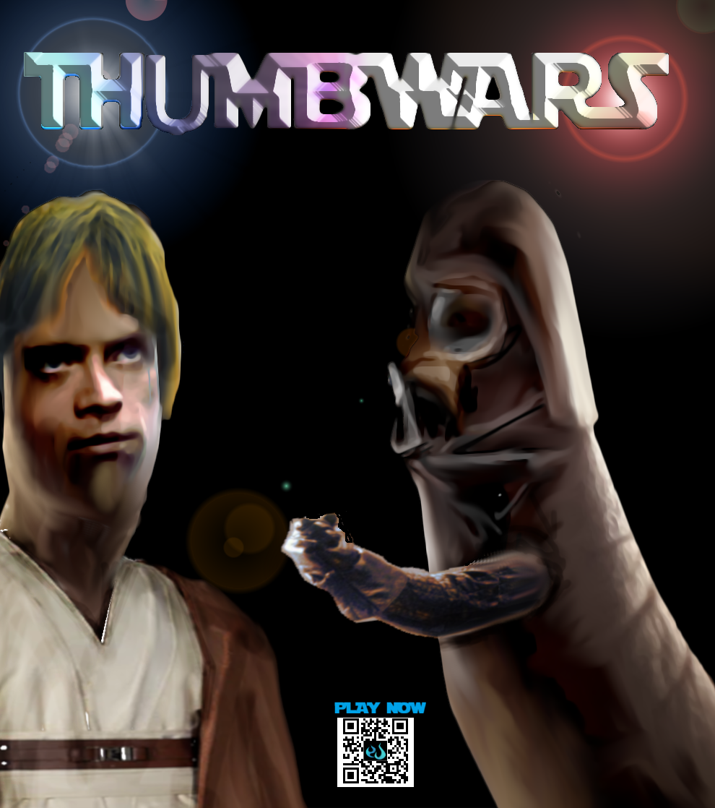

# Thumb-War-Online
A simple node based game that lets 2-3 people have a thumbwar. The game is mobile friendly, realtime, and approximates a real thumb-war.
Using the mobile controls players attempt to position their thumb on top of other player thumbs by using the Raise/Pin button to lift and hold their thumb down.

#### @ icon-info-circle Notice

