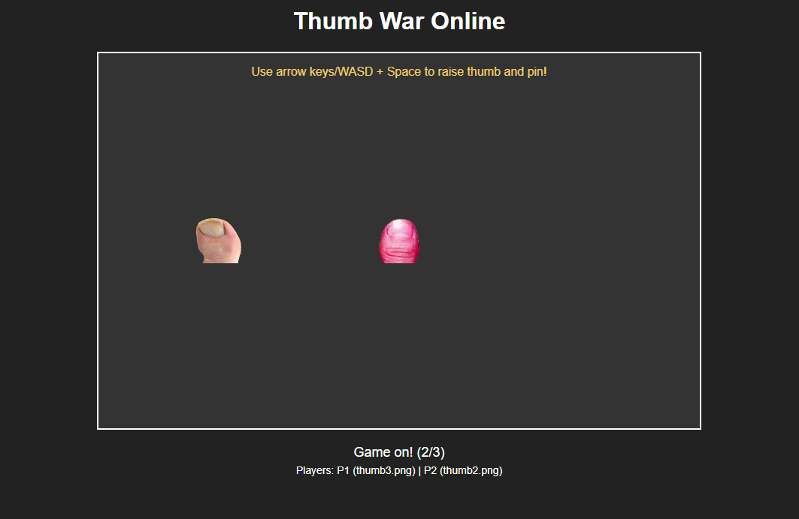

# Thumb-War-Online
A simple node based game that lets 2-3 people have a thumbwar. 

The game is mobile friendly, real-time, approximates a real thumb-war.

---

# PlayNow on my Demo Server!!

----

# Thumbwar on a Mobile Device

----

# Thumbwar on a PC Browser

----

* [ ] Suports up to 3 players per session 
* [ ] Mobile On-Screen controls 
* [ ] Keyboard controls supported
* [ ] Uses the concept of "Rooms" to allow concurrent game sessions via websockets.

----

Technologies Used

----

> * Node
> * Javascript
> * HTML

----
